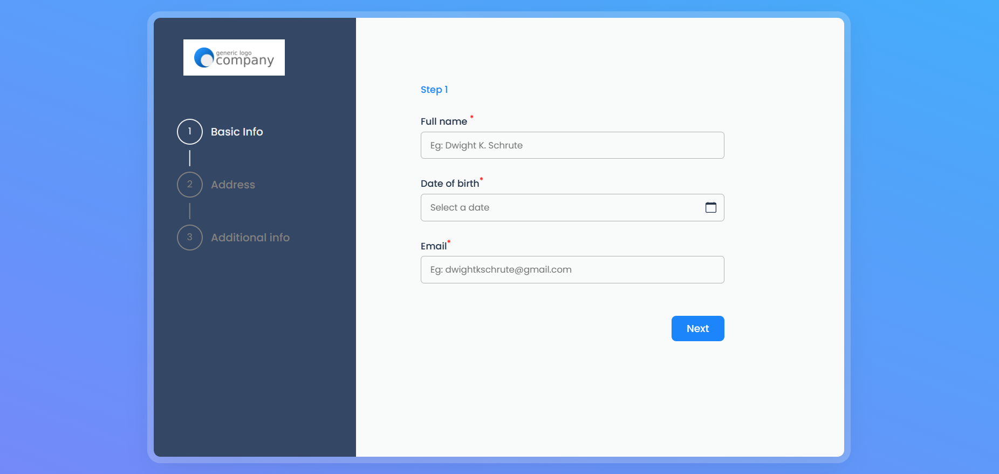

# Animated Stepper Form

Experimenting with an animated stepper form using a carousel.

&nbsp;

## Screenshot

&nbsp;

## Link

[Live project here](https://animated-stepper-form.vercel.app)

&nbsp;

## Technologies used

- React
- Typescript
- Styled Components
- Alice carousel

&nbsp;

## FAQs (for future me)

 

  
Why use a carousel?

I did try doing everything myself, but faced issues around updating the form state and the custom animation simultaneously. Too much time was being spent there and I thought I could easily bypass that whole shenanigan by utilizing a carousel.

 

  
Pros?

- Definitely less CSS and custom animations. Big W.
- No need for extra logic aside basic form controls to prevent a user from moving to the next step prematurely.

 

  
Cons?

- Alice behaves a little unpredictably sometimes.

 

  
Can you use this in other projects?

<b>Abso-fruitly!</b>

&nbsp;

Compare against Swiper carousel [here](https://github.com/CHR-onicles/animated-stepper-form/tree/18-swiper-carousel#faqs-for-future-me)
